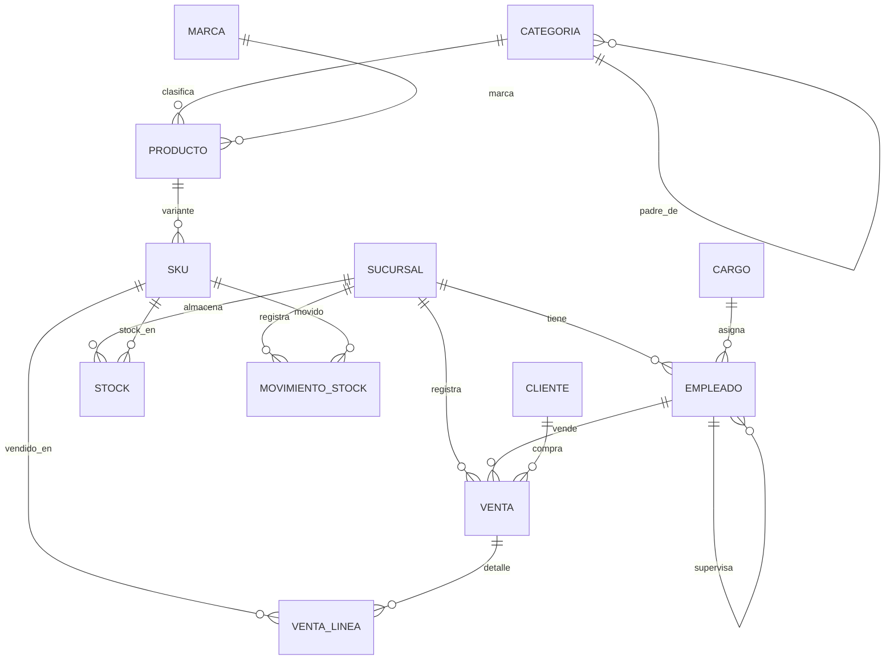
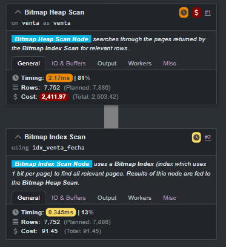
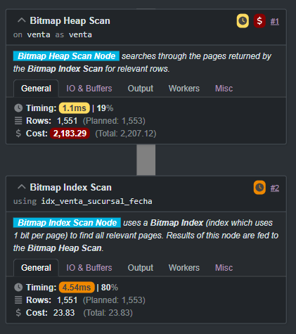
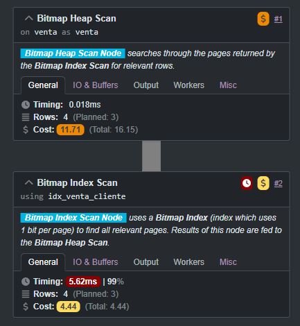
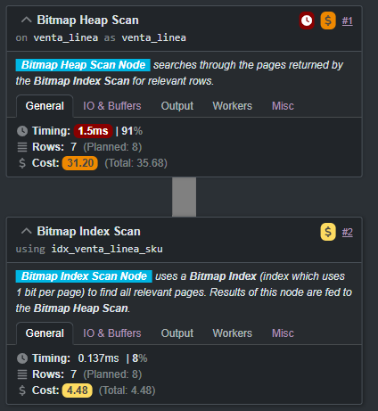

# FeRReT — Sistema de Gestión de Ferretería

Proyecto Integrador **Parte 1** — Unidad Curricular **Base de Datos III**, Eje I (Optimización y SQL Avanzado).

## Equipo

| Integrante | GitHub | Rol |
|---|---|---|
| Federico | [@Frederick1824](https://github.com/Frederick1824) | 🧱 Modelado & DER |
| Lautaro  | [@LautaroAi](https://github.com/LautaroAi)         | 📦 Carga masiva |
| Mariano  | [@marianof87](https://github.com/marianof87)       | ⚡ Indexación & Performance |
| Gabriel  | [@Nubiru](https://github.com/Nubiru)               | 🧠 SQL Avanzado |

Detalle de cada rol y checklist en [`TAREAS.md`](TAREAS.md). Convenciones de trabajo en equipo en [`guia.md`](guia.md).

## El problema

**FeRReT** es una cadena de ferretería grande con **5 sucursales + 1 depósito central**, flota propia de camiones para mover mercadería entre ubicaciones, inventario complejo con decenas de miles de SKUs, y ~200 empleados organizados jerárquicamente (ejecutivos, administrativos, cajeros, vendedores, transportistas, compras, guardias).

Operaciones que el sistema soporta:

- **Catálogo jerárquico** de productos (categorías anidadas).
- **SKUs / variantes** por producto (mismo producto, distintas presentaciones).
- **Stock multi-sucursal** y movimientos entre depósito central y sucursales.
- **Ventas mayoristas y minoristas** con líneas de detalle.
- **Organigrama** jerárquico de empleados.

## Stack

- **PostgreSQL** ≥ 14
- **DBeaver** como cliente de modelado y administración
- Extensiones: `btree_gist`, `pg_stat_statements`
- Visualización de planes: **Dalibo / PEV2**

---

## DER — Diagrama Entidad-Relación

Versión visual exportada desde DBeaver: ver [`docs/DER/`](docs/DER/).

Versión Mermaid (renderiza nativo en GitHub):



Detalle completo con tipos y atributos en [`docs/DER/DER.mmd`](docs/DER/DER.mmd).

---

## Requisitos oficiales — Mapa de cumplimiento

| Consigna | Implementación | Archivo |
|---|---|---|
| DER 3NF | 13 tablas normalizadas, 2 jerarquías recursivas | [`sql/01_schema.sql`](sql/01_schema.sql) |
| ≥ 1.000.000 registros | **1.74M** registros cargados | [`sql/03_seed.sql`](sql/03_seed.sql) |
| Índice **B-Tree** | `venta.fecha_venta`, `(sucursal_id, fecha_venta)`, `cliente_id`, `sku`, etc. | [`sql/02_indexes.sql`](sql/02_indexes.sql) |
| Índice **Hash** | `cliente.email`, `sku.codigo_barras` | [`sql/02_indexes.sql`](sql/02_indexes.sql) |
| Índice **GIN** | `producto.atributos` JSONB con `jsonb_path_ops` | [`sql/02_indexes.sql`](sql/02_indexes.sql) |
| EXPLAIN ANALYZE antes/después | Queries con `SET enable_seqscan/indexscan` | [`sql/04_queries.sql`](sql/04_queries.sql) |
| Diagramas Dalibo PEV2 | 4 diagramas (1 por índice) | [`docs/dalibo/`](docs/dalibo/) |
| Window Functions | `RANK()`, `SUM() OVER`, `AVG() OVER ROWS BETWEEN` | [`sql/05_advanced_sql.sql`](sql/05_advanced_sql.sql) |
| CTE Recursiva | Categorías + Organigrama de empleados | [`sql/05_advanced_sql.sql`](sql/05_advanced_sql.sql) |

---

## A. Modelado & DER ([@Frederick1824](https://github.com/Frederick1824))

Schema 3NF con 13 tablas principales, 2 jerarquías recursivas (`categoria.padre_id` y `empleado.supervisor_id`) y soporte JSONB para atributos variables de producto.

DER exportado desde DBeaver:


## B. Carga Masiva ([@LautaroAi](https://github.com/LautaroAi))

Script de seed que carga **1.740.376 registros** distribuidos:

| Tabla | Registros |
|---|---:|
| `sucursal` | 6 |
| `camion` | 15 |
| `cargo` | 5 |
| `empleado` | 200 |
| `marca` | 100 |
| `categoria` | 50 |
| `producto` | 30.000 |
| `sku` | 80.000 |
| `stock` | 480.000 |
| `cliente` | 100.000 |
| `venta` | 200.000 |
| `venta_linea` | 600.000 |
| `movimiento_stock` | 150.000 |
| **TOTAL** | **1.740.376** |

Tiempo de carga: ~50 segundos en hardware estándar.

## C. Indexación & Performance ([@marianof87](https://github.com/marianof87))

Análisis con Dalibo / PostgreSQL Explain Visualizer (PEV2). Cada índice se valida con un `EXPLAIN ANALYZE` que confirma el `Bitmap Index Scan` correspondiente:

### `idx_venta_fecha` — B-Tree sobre `venta.fecha_venta`
Búsquedas por rango de fechas. Tiempo: **0.345 ms**.



### `idx_venta_sucursal_fecha` — B-Tree compuesto sobre `(sucursal_id, fecha_venta)`
Filtros combinados de sucursal + período. Tiempo: **4.54 ms**.



### `idx_venta_cliente` — B-Tree sobre `venta.cliente_id`
Lookup de ventas por cliente. Tiempo: **5.62 ms**.



### `idx_venta_linea_sku` — B-Tree sobre `venta_linea.sku_id`
Lookup de líneas de venta por SKU (tabla de 600k filas). Tiempo: **0.137 ms**.



---

## D. SQL Avanzado ([@Nubiru](https://github.com/Nubiru))

Cinco consultas que combinan **Window Functions** y **CTEs Recursivas** sobre las dos jerarquías del modelo. Ver [`sql/05_advanced_sql.sql`](sql/05_advanced_sql.sql).

### Q1 — Top 3 vendedores por sucursal (`RANK()`)

```
  sucursal  |       vendedor        | cantidad_ventas | total_facturado | puesto
------------+-----------------------+-----------------+-----------------+--------
 Sucursal 1 | Nombre186 Apellido186 |             123 |       639563.44 |      1
 Sucursal 1 | Nombre40  Apellido40  |             120 |       627733.29 |      2
 Sucursal 1 | Nombre111 Apellido111 |             116 |       626244.01 |      3
 Sucursal 2 | Nombre29  Apellido29  |             241 |      1255284.65 |      1
 ...
(18 filas — 6 sucursales × 3 puestos)
```

### Q2 — Acumulado mensual + promedio móvil 3M (`SUM/AVG OVER`)

```
  sucursal  |    mes     | total_mes  |  acumulado   | promedio_movil_3m
------------+------------+------------+--------------+-------------------
 Sucursal 1 | 2024-05-01 | 3303322.36 |   3303322.36 |        3303322.36
 Sucursal 1 | 2024-06-01 | 3888740.70 |   7192063.06 |        3596031.53
 Sucursal 1 | 2024-07-01 | 4231650.31 |  11423713.37 |        3807904.46
 ...
(144 filas — 6 sucursales × 24 meses)
```

### Q3 — Árbol de categorías (CTE Recursiva)

```
 nivel |       categoria       | productos
-------+-----------------------+-----------
     0 | Categoria 1           |       282
     1 |   Categoria 11        |       640
     2 |     Categoria 31      |       595
     1 |   Categoria 21        |       593
     2 |     Categoria 41      |       583
     0 | Categoria 2           |       604
     1 |   Categoria 12        |       571
     ...
```

3 niveles de profundidad. Ruta completa con indentación visual.

### Q4 — Cadena de mando (CTE Recursiva)

```
 nivel | id  |       empleado        |     cargo
-------+-----+-----------------------+----------------
     0 | 150 | Nombre150 Apellido150 | Gerente
     1 |  33 | Nombre33  Apellido33  | Gerente
     2 |   3 | Nombre3   Apellido3   | Administrativo
     3 |   1 | Nombre1   Apellido1   | Chofer (CEO)
```

Sube por `supervisor_id` desde un empleado dado hasta la raíz del organigrama.

### Q5 — Bonus: Window + GIN sobre JSONB

Top 10 productos de material `acero` por unidades vendidas. Demuestra que el índice GIN de Stream C se usa en consultas de negocio reales:

```
  id   |     nombre     | material | unidades | r
-------+----------------+----------+----------+----
 29297 | Producto 29297 | acero    |      623 |  1
 28402 | Producto 28402 | acero    |      549 |  2
  2945 | Producto 2945  | acero    |      538 |  3
 ...
```

**EXPLAIN del filtro JSONB** (confirma uso del GIN):

```
Bitmap Heap Scan on producto  (cost=86.71..691.11 rows=14832 width=4)
  Recheck Cond: (atributos @> '{"material": "acero"}'::jsonb)
  ->  Bitmap Index Scan on idx_producto_atributos_gin
        Index Cond: (atributos @> '{"material": "acero"}'::jsonb)
```

---

## Estructura del repositorio

```
ferret/
├── README.md                 ← este archivo
├── TAREAS.md                 ← división de trabajo y checklist por rol
├── guia.md                   ← convenciones de equipo (git, commits, SQL)
├── propuesta_proyecto.md     ← consigna oficial
├── proyecto_integrador.docx  ← consigna oficial
├── docs/
│   ├── DER/
│   │   ├── DER.mmd                          ← DER en Mermaid (texto)
│   │   ├── Ndiagrama.png                    ← DER exportado
│   │   └── postgres - ferret_db - public.png
│   ├── DER.pdf.dbp                          ← proyecto DBeaver del DER
│   └── dalibo/
│       ├── 01_idx_venta_fecha.png
│       ├── 02_idx_venta_sucursal_fecha.png
│       ├── 03_idx_venta_cliente.png
│       └── 04_idx_venta_linea_sku.png
└── sql/
    ├── 01_schema.sql         ← DDL normalizado 3NF
    ├── 02_indexes.sql        ← B-Tree + Hash + GIN
    ├── 03_seed.sql           ← carga masiva (1.74M registros)
    ├── 04_queries.sql        ← EXPLAIN ANALYZE antes/después (Mariano)
    └── 05_advanced_sql.sql   ← Window functions + CTEs recursivas (Gabriel)
```

## Cómo reproducirlo

```bash
createdb ferret_db
psql -d ferret_db -f sql/01_schema.sql      # 13 tablas
psql -d ferret_db -f sql/03_seed.sql        # 1.74M registros (~50 seg)
psql -d ferret_db -f sql/02_indexes.sql     # B-Tree + Hash + GIN
psql -d ferret_db -f sql/05_advanced_sql.sql # Stream D
```

Los EXPLAIN comparativos de Stream C se corren a mano desde `sql/04_queries.sql` para poder copiar los planes JSON a [Dalibo PEV2](https://explain.dalibo.com/).
